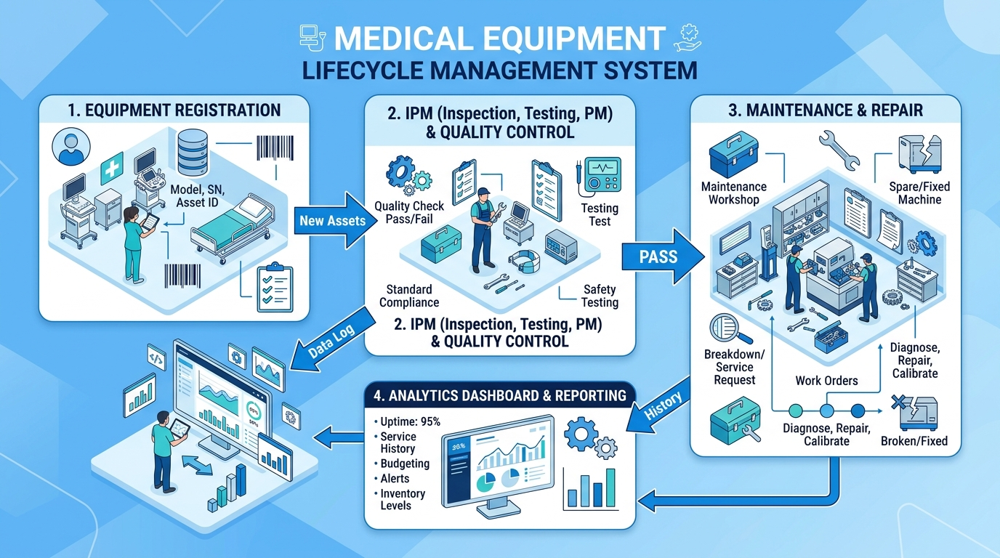

# คู่มือการใช้งานและเอกสารสรุปสถาปัตยกรรมระบบบริหารจัดการเครื่องมือแพทย์
## Medical Device Management & Maintenance System Manual

> ข้อมูลหน่วยงาน บุคคล หมายเลขครุภัณฑ์ และประวัติทั้งหมดใน repository
> สาธารณะนี้เป็นข้อมูลตัวอย่างสมมติ



---

## 📋 สารบัญ (Table of Contents)
1. [ภาพรวมของระบบและโครงสร้างโค้ด (System & Code Architecture)](#1-ภาพรวมของระบบและโครงสร้างโค้ด)
2. [ตารางสิทธิ์ผู้ใช้งาน (Role-Based Access Control - RBAC)](#2-ตารางสิทธิ์ผู้ใช้งาน)
3. [คู่มือการใช้งานระบบแต่ละส่วน (Step-by-Step User Guide)](#3-คู่มือการใช้งานระบบแต่ละส่วน)
   - [3.1 การเข้าสู่ระบบ (Login) และ Skeleton Loader](#31-การเข้าสู่ระบบ-login-และ-skeleton-loader)
   - [3.2 หน้าภาพรวมระบบ (Dashboard & Analytics)](#32-หน้าภาพรวมระบบ-dashboard--analytics)
   - [3.3 ทะเบียนครุภัณฑ์เครื่องมือแพทย์ (Asset Registry)](#33-ทะเบียนครุภัณฑ์เครื่องมือแพทย์-asset-registry)
   - [3.4 งานตรวจเช็คบำรุงรักษา IPM (IPM Workflow)](#34-งานตรวจเช็คบำรุงรักษา-ipm-ipm-workflow)
   - [3.5 งานซ่อมบำรุงเครื่องมือแพทย์ (Maintenance & Repair)](#35-งานซ่อมบำรุงเครื่องมือแพทย์-maintenance--repair)
   - [3.6 รายงานและใบรับรอง (Reporting & Certificates)](#36-รายงานและใบรับรอง-reporting--certificates)
   - [3.7 การบริหารผู้ใช้และประวัติการใช้งาน (User & System Audit Logs)](#37-การบริหารผู้ใช้และประวัติการใช้งาน)
4. [ความปลอดภัยและการรักษาความถูกต้องของข้อมูล (Security & Data Integrity)](#4-ความปลอดภัยและการรักษาความถูกต้องของข้อมูล)

---

## 1. ภาพรวมของระบบและโครงสร้างโค้ด

ระบบบริหารจัดการเครื่องมือแพทย์ได้รับการออกแบบในรูปแบบ **Full-Stack Application** ที่รองรับวงจรชีวิตของเครื่องมือแพทย์ (Medical Device Lifecycle) ตั้งแต่การลงทะเบียนรับเข้า การตรวจเช็คคุณภาพตามมาตรฐาน (IPM QA/PM) การซ่อมบำรุงรักษา และการออกรายงานใบรับรอง

### 🛠️ เทคโนโลยีที่ใช้ในระบบ (Tech Stack)
* **Frontend**: React 19, TypeScript, Tailwind CSS, Lucide Icons, Motion (สำหรับ Animation)
* **Backend**: Express.js (Node.js), TypeScript, JSON Web Token (JWT) สำหรับระบบความปลอดภัย
* **Database Layer**: PostgreSQL (Cloud SQL Support) พร้อมระบบสำรอง Local In-Memory Fallback
* **Build Tooling**: Vite, esbuild

### 📁 โครงสร้างซอร์สโค้ดหลัก (Key Codebase Structure)
```text
├── server.ts                       # Backend Server Entry point, REST API & Auth Middleware
├── src/
│   ├── App.tsx                     # Main Frontend Application & Layout State Router
│   ├── components/
│   │   ├── LoginScreen.tsx          # หน้าจอเข้าสู่ระบบ พร้อม Rate Limiting & Feedback Loading
│   │   ├── AppSkeleton.tsx          # โครงสร้างหน้าโหลด Skeleton Loader ในช่วงดึงข้อมูล
│   │   ├── Sidebar.tsx             # แถบเมนูด้านข้าง พร้อมการซ่อนเมนูตามสิทธิ์ (RBAC)
│   │   ├── Dashboard.tsx            # สถิติ ภาพรวมข้อมูล และการแจ้งเตือน
│   │   ├── AssetRegistry.tsx        # ทะเบียนครุภัณฑ์ การค้นหา นำเข้า นำออก PDF
│   │   ├── RegistrationForm.tsx     # ฟอร์มเพิ่ม/แก้ไขข้อมูลเครื่องมือแพทย์
│   │   ├── IPMWorkflow.tsx          # งานตรวจเช็ค IPM เชิงคุณภาพและเชิงปริมาณ
│   │   ├── RepairWorkflow.tsx       # งานรับเรื่องแจ้งซ่อมและบันทึกการซ่อม
│   │   ├── ReportingWorkflow.tsx    # การพิมพ์รายงานและใบรับรอง Calibration
│   │   └── UserManagement.tsx       # จัดการบัญชีผู้ใช้ (สิทธิ์ Admin เท่านั้น)
│   └── utils/
│       ├── api.ts                   # ศูนย์กลางการเรียกใช้งาน REST API พร้อมส่ง JWT Header
│       └── dateUtils.ts             # ระบบแปลงวันที่ พ.ศ. / ค.ศ.
```

---

## 2. ตารางสิทธิ์ผู้ใช้งาน (Role-Based Access Control - RBAC)

ระบบควบคุมสิทธิ์ตามบทบาทของผู้ใช้งาน เพื่อความปลอดภัยและการแบ่งหน้าที่ชัดเจน:

| บทบาท (Role) | ชื่อภาษาไทย | สิทธิ์การเข้าถึงเมนู | สิทธิ์การจัดการข้อมูล |
| :--- | :--- | :--- | :--- |
| **Admin** | ผู้ดูแลระบบ | เข้าถึงได้ทุกเมนู (`Dashboard`, `Registry`, `IPM`, `Repair`, `Reporting`, `Users`, `History`) | สิทธิ์เต็มในการสร้าง แก้ไข ลบ และเพิ่มผู้ใช้งาน |
| **Registration** | ฝ่ายลงทะเบียน | `Dashboard`, `Registry`, `IPM`, `Repair`, `Reporting` | ลงทะเบียนเครื่องใหม่ นำเข้าไฟล์ แก้ไข และ**ลบเครื่องมือ**ได้ |
| **IPM** | ฝ่ายตรวจสอบคุณภาพ | `Dashboard`, `Registry`, `IPM`, `Repair`, `Reporting` | บันทึกผลการตรวจเช็ค IPM / QA ปรับสถานะผ่านหรือไม่ผ่าน |
| **Repair** | ฝ่ายซ่อมบำรุง | `Dashboard`, `Registry`, `IPM`, `Repair`, `Reporting` | รับเรื่องแจ้งซ่อม บันทึกผลการวิเคราะห์ และปิดงานซ่อม |
| **Reporting** | ฝ่ายรายงาน | `Dashboard`, `Registry`, `IPM`, `Repair`, `Reporting` | ดูข้อมูล ออกรายงาน และพิมพ์ใบรับรอง Calibration |

> 🔒 **การซ่อนเมนูอัตโนมัติ**: เมนู `ผู้ใช้งาน (User Management)` และ `ประวัติการเข้าใช้ (Login History)` จะถูก**ซ่อนจาก Sidebar อัตโนมัติ**เมื่อผู้ใช้ล็อกอินด้วยสิทธิ์ที่ไม่ใช่ Admin

---

## 3. คู่มือการใช้งานระบบแต่ละส่วน

### 3.1 การเข้าสู่ระบบ (Login) และ Skeleton Loader

1. เข้าสู่วงการใช้งานที่หน้า **Login** กรอก `ชื่อผู้ใช้งาน (Username)` และ `รหัสผ่าน (Password)`
2. เมื่อกดปุ่ม **"เข้าสู่ระบบ"**:
   * ปุ่มจะเปลี่ยนสถานะเป็น Loading แบบบล็อกปฏิสัมพันธ์ พร้อมข้อความ *"กำลังติดต่อเซิร์ฟเวอร์เพื่อตรวจสอบสิทธิ์..."*
   * หากระบบกำลังดึงข้อมูล Backend ระบบจะแสดง **Skeleton Loader (หน้าโครงร่างเว็บไซต์)** เพื่อให้ผู้ใช้ทราบว่าระบบกำลังทำงานและโหลดข้อมูลอยู่
3. ในกรณีที่ใส่รหัสผ่านผิดเกินจำนวนกำหนด ระบบมี **Rate Limiting Protection** ช่วยป้องกันการสุ่มรหัสผ่าน

---

### 3.2 หน้าภาพรวมระบบ (Dashboard & Analytics)

หน้าแดชบอร์ดสรุปข้อมูลภาพรวมของเครื่องมือแพทย์ในโรงพยาบาล:
* **การ์ดตัวเลขสรุป (Key Metrics)**: แสดงจำนวนเครื่องทั้งหมด, เครื่องที่เปิดใช้งานปกติ, เครื่องที่อยู่ระหว่าง IPM และเครื่องที่ชำรุด/รอซ่อม
* **ภาพสรุปเชิงสถิติ**: สรุปสถานะเครื่องมือแบ่งตามประเภทและพื้นที่/โรงพยาบาล
* **รายการแจ้งเตือนการบำรุงรักษา**: แสดงรายการเครื่องมือที่ครบรอบการตรวจเช็ค IPM หรือจำเป็นต้องได้รับการซ่อมบำรุงด่วน

---

### 3.3 ทะเบียนครุภัณฑ์เครื่องมือแพทย์ (Asset Registry)

ศูนย์รวมข้อมูลครุภัณฑ์เครื่องมือแพทย์ทั้งหมดในระบบ:
1. **การค้นหาและคัดกรองข้อมูล**:
   * คัดกรองตาม **จังหวัด** (ตัวอย่างเหนือ / ตัวอย่างกลาง) หรือ **โรงพยาบาล**
   * ช่องค้นหาด่วนตามชื่อเครื่อง เลขครุภัณฑ์ หรือ Serial Number
2. **การเพิ่มและนำเข้าข้อมูล**:
   * **ปุ่มลงทะเบียนเครื่องใหม่**: เปิดฟอร์มบันทึกข้อมูลเครื่องมือแพทย์
   * **ปุ่มนำเข้าข้อมูล**: รองรับการนำเข้าไฟล์รูปแบบ Excel, CSV หรือ PDF
3. **การแก้ไขและการลบข้อมูล**:
   * ผู้ใช้สิทธิ์ **Registration** และ **Admin** สามารถกดปุ่มแก้ไขข้อมูลหรือ**ลบข้อมูลครุภัณฑ์**กรณีเกิดข้อผิดพลาดได้
   * มีปุ่ม **"ส่งตรวจเช็ค IPM"** เพื่อส่งครุภัณฑ์เข้าสู่งานประกันคุณภาพ IPM

---

### 3.4 งานตรวจเช็คบำรุงรักษา IPM (IPM Workflow)

กระบวนการตรวจสอบและบำรุงรักษาเครื่องมือแพทย์ตามมาตรฐาน:
1. **เลือกเครื่องที่ต้องการตรวจเช็ค**: จากตารางงาน IPM
2. **บันทึกผลการตรวจสอบ**:
   * **การตรวจเชิงคุณภาพ (Qualitative Check)**: ตรวจสอบสายไฟ ตัวเครื่อง สวิตช์ และอุปกรณ์ประกอบ
   * **การตรวจเชิงปริมาณ (Quantitative Check)**: วัดค่าพารามิเตอร์ไฟฟ้า/ประสิทธิภาพเครื่องด้วยเครื่องมือวัด
3. **สรุปผลการประเมิน**:
   * หากผ่านเกณฑ์ ➔ ระบบปรับสถานะเป็น **"ผ่านการตรวจเช็ค (Passed)"** พร้อมออกผลการทดสอบ
   * หากพบข้อบกพร่อง ➔ ปรับสถานะเป็น **"ไม่ผ่าน (Failed)"** และสามารถส่งเรื่องเข้าสู่งานซ่อมบำรุงต่อได้ทันที

---

### 3.5 งานซ่อมบำรุงเครื่องมือแพทย์ (Maintenance & Repair)

การจัดการงานซ่อมบำรุงเมื่อเครื่องมือเกิดการชำรุดเสียหาย:
1. **การรับเรื่องแจ้งซ่อม**: แสดงรายการเครื่องที่แจ้งซ่อมเข้ามาในระบบ
2. **การบันทึกการวิเคราะห์ (Diagnosis)**: บันทึกสาเหตุการชำรุด รายการอะไหล่ที่ต้องเปลี่ยน และค่าใช้จ่าย
3. **การปิดงานซ่อม**: เมื่อซ่อมเสร็จสิ้น สามารถปรับสถานะเป็น **"ซ่อมเสร็จสิ้น (Repaired)"** เพื่อส่งเครื่องกลับไปใช้งานตามปกติ

---

### 3.6 รายงานและใบรับรอง (Reporting & Certificates)

1. **ใบรับรองการตรวจเช็ค (IPM / Calibration Certificate)**:
   * ออกเอกสารใบรับรองตามมาตรฐานวิศวกรรมการแพทย์
   * พร้อมสำหรับการพิมพ์ลงกระดาษ หรือบันทึกเป็น PDF
2. **รายงานสรุปสถิติ**:
   * พิมพ์รายงานสรุปภาพรวมรายเดือน รายปี หรือแยกตามหน่วยงาน

---

### 3.7 การบริหารผู้ใช้และประวัติการใช้งาน

*(แสดงผลเฉพาะผู้ใช้งานสิทธิ์ Admin)*

1. **การจัดการผู้ใช้ (User Management)**:
   * เพิ่มผู้ใช้ใหม่ แก้ไขชื่อ-รหัสผ่าน และกำหนดบทบาท (Role)
2. **ประวัติการลงชื่อเข้าใช้ (Login History)**:
   * บันทึกบัญชี บทบาท และเวลาที่เข้าใช้งาน โดยแสดงผลเฉพาะผู้ดูแลระบบ

---

## 4. ความปลอดภัยและการรักษาความถูกต้องของข้อมูล

1. **Authentication Token (JWT)**: ทุกการเรียกใช้งาน API ฝั่ง Backend จะต้องผ่านการยืนยันตัวตนด้วย Bearer Token ใน HTTP Headers
2. **Backend Role Validation**: นอกเหนือจากการซ่อน UI ปุ่มและเมนูใน Frontend แล้ว เซิร์ฟเวอร์ Express.js ตรวจสอบสิทธิ์ `req.user.role` สำหรับ endpoint ข้อมูลและการดำเนินการที่ได้รับการป้องกัน
3. **Skeleton Loading UX**: หน้าเว็บออกแบบโครงสร้างชั่วคราวขณะโหลด ช่วยป้องกันปัญหาผู้ใช้กดปุ่มซ้ำขณะรอการตอบกลับจากเซิร์ฟเวอร์

---
*เอกสารนี้จัดทำขึ้นสำหรับระบบบริหารจัดการเครื่องมือแพทย์ (Medical Device Management System)*
