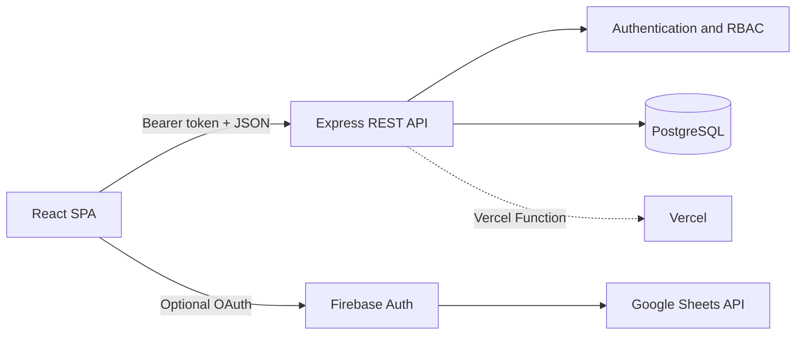

# Medical Device Lifecycle Manager

A full-stack portfolio project for managing the inspection, preventive
maintenance, repair, and reporting lifecycle of biomedical equipment.

The application combines a responsive React dashboard with a role-protected
Express API and PostgreSQL persistence. All facilities, devices, people, and
identifiers included in this public repository are fictional sample data.

## Project overview

Medical Device Lifecycle Manager demonstrates an end-to-end operational
workflow:

1. Register or import a medical device.
2. Perform inspection and preventive-maintenance checks.
3. Route failed equipment through repair.
4. Review results and issue a certificate.
5. Search asset history and monitor activity through dashboards.

The interface is primarily Thai with supporting English terminology.

## Features

- Role-based access for administrators, registration staff, inspectors,
  repair technicians, and reporting staff
- Medical-device registry with filtering, search, CSV/Excel/PDF import, and
  PDF export
- Device-specific qualitative and quantitative IPM checklists
- Repair workflow with diagnosis, parts, cost, and technician tracking
- Certificate generation, printable reports, and Google Sheets export
- Dashboard metrics by workflow status, facility, and sample region
- User profile management and administrator-only login history
- PostgreSQL persistence with a local in-memory development mode
- Responsive layouts, loading skeletons, and lazy-loaded workflow pages

## Tech stack

| Layer | Technologies |
| --- | --- |
| Frontend | React 19, TypeScript, Vite, Tailwind CSS 4, Motion, Lucide React |
| Backend | Node.js, Express 4, TypeScript, bcrypt, signed session tokens |
| Database | PostgreSQL via `pg`; compatible with pooled Supabase PostgreSQL connections |
| Documents | jsPDF, jsPDF AutoTable, SheetJS |
| Integrations | Firebase Authentication, Google Sheets API |
| Deployment | Vercel Functions and Vite static hosting |

## System architecture




The Vite application calls same-origin `/api/*` routes. Vercel rewrites those
requests to `api/index.ts`, which adapts the request for the shared Express
application in `server.ts`. Database credentials and signing secrets remain
server-side.

## Installation

Prerequisites:

- Node.js 20 or newer
- npm 10 or newer
- PostgreSQL for persistent storage (optional for local UI evaluation)

```bash
git clone https://github.com/Natchapoom2548/IPM-System-Portfolio.git
cd IPM-System-Portfolio
npm install
cp .env.example .env
```

Replace every placeholder in `.env` before starting the application.
Leave `DATABASE_URL` and the optional Firebase variables empty for the
self-contained in-memory demo.

## Environment variables

| Variable | Required | Purpose |
| --- | --- | --- |
| `DATABASE_URL` | Production | Pooled PostgreSQL connection string |
| `PGSSL` | Hosted databases | Enables TLS for PostgreSQL |
| `PGSSL_REJECT_UNAUTHORIZED` | Recommended | Keeps certificate verification enabled |
| `JWT_SECRET` | Yes | Signs 24-hour application sessions; use at least 32 random characters |
| `ADMIN_PASSWORD` | Initial setup | Password for the initial administrator |
| `DEFAULT_USER_PASSWORD` | Initial setup | Temporary password for initial workflow accounts |
| `DEMO_MODE` | Portfolio demo only | Allows the fictional in-memory store without `DATABASE_URL` |
| `CORS_ORIGIN` | Optional | Comma-separated trusted cross-origin API clients |
| `VITE_FIREBASE_API_KEY` | Google Sheets only | Restricted Firebase Web API key |
| `VITE_FIREBASE_AUTH_DOMAIN` | Google Sheets only | Firebase Authentication domain |
| `VITE_FIREBASE_PROJECT_ID` | Google Sheets only | Firebase project identifier |
| `VITE_FIREBASE_STORAGE_BUCKET` | Google Sheets only | Firebase storage bucket |
| `VITE_FIREBASE_MESSAGING_SENDER_ID` | Google Sheets only | Firebase sender identifier |
| `VITE_FIREBASE_APP_ID` | Google Sheets only | Firebase Web application identifier |

Variables prefixed with `VITE_` are bundled into client code and must never
contain server secrets. Firebase Web keys should be restricted by API and
authorized domain in the Firebase console.

## Running locally

```bash
npm run dev
```

The application is served at `http://localhost:3000`.

When `DATABASE_URL` is omitted, development uses an in-memory store. Set
`JWT_SECRET`, `ADMIN_PASSWORD`, and `DEFAULT_USER_PASSWORD` in either mode.
In-memory data is reset whenever the server restarts.

Useful checks:

```bash
npm run lint
npm run build
npm run build:node
npm start
```

`npm run build` creates only the Vite static assets used by Vercel.
`npm run build:node` additionally creates a private Node server bundle for
testing a production-style build locally.

## Demo

The repository is self-contained in demo mode. When `DEMO_MODE=true` and
`DATABASE_URL` is empty, the API uses an in-memory store and the UI loads the
fictional device dataset from `src/data/mockData.ts`. Data resets whenever the
Node process or serverless instance restarts.
The Google Sheets control is disabled until all optional Firebase variables
are configured.

The following seeded usernames are deliberately prefixed with `demo_`:

| Username | Role | Password source |
| --- | --- | --- |
| `demo_admin` | Administrator | `ADMIN_PASSWORD` |
| `demo_registration` | Device registration | `DEFAULT_USER_PASSWORD` |
| `demo_ipm` | Inspection and maintenance | `DEFAULT_USER_PASSWORD` |
| `demo_repair` | Repair | `DEFAULT_USER_PASSWORD` |
| `demo_reporting` | Reporting and certificates | `DEFAULT_USER_PASSWORD` |

Choose local password values in `.env`; no credential is committed to the
repository. All facilities, staff names, device identifiers, activity
records, logos, and regional labels shown by the demo are fictional.

## Folder structure

```text
.
├── api/                 # Vercel Function adapter
├── src/
│   ├── assets/          # Generic portfolio images and fonts
│   ├── components/      # Screens and workflow UI
│   ├── data/            # Fictional demo dataset
│   ├── lib/             # Optional Firebase and Google Sheets clients
│   ├── styles/          # Application styling
│   ├── utils/           # Shared browser utilities
│   ├── App.tsx          # Application shell and client state
│   └── types.ts         # Domain types
├── server.ts            # Express API, auth, RBAC, and persistence
├── vercel.json          # Build and routing configuration
└── vite.config.ts       # Vite and bundle configuration
```

## Deploying to Vercel

1. Import the repository into Vercel.
2. Configure all server variables for Production, Preview, and Development.
   For a non-persistent portfolio demo, set `DEMO_MODE=true` and leave
   `DATABASE_URL` empty. For persistent use, set `DEMO_MODE=false` and provide
   `DATABASE_URL`.
3. Configure the optional Firebase variables if Google Sheets export is used.
4. Ensure the PostgreSQL schema has been initialized before the first
   production request.
5. Deploy. `vercel.json` builds the Vite app and routes `/api/*` to the
   Express-backed Vercel Function.

For a new database, run the application once outside Vercel with
`DATABASE_URL` and the initial password variables configured. This performs
the idempotent schema initialization and creates the initial accounts. Vercel
cold starts intentionally do not execute database-definition changes.

## Screenshots

Public screenshots are intentionally not bundled because the original
application views contained deployment-specific operational data. Add
sanitized screenshots after deploying the sample dataset:

- Login and role selection
- Executive dashboard
- Device registry
- IPM checklist workflow
- Certificate and reporting view

## Live demo

A public demo URL is not included in this repository. After deployment,
replace this section with the Vercel URL and provide dedicated, rate-limited
demo credentials using the documented `demo_` accounts.

## Future improvements

- Replace browser `localStorage` sessions with secure, HTTP-only cookies
- Add request-schema validation and generated OpenAPI documentation
- Add unit, integration, and end-to-end test coverage
- Move schema evolution to versioned database migrations
- Self-host fonts and PDF parsing assets for stricter Content Security Policy
- Split the largest workflow components into focused feature modules
- Add CI checks for linting, builds, dependency auditing, and secret scanning

## License

Licensed under the [Apache License 2.0](./LICENSE), matching the SPDX headers
already present in the source files.
