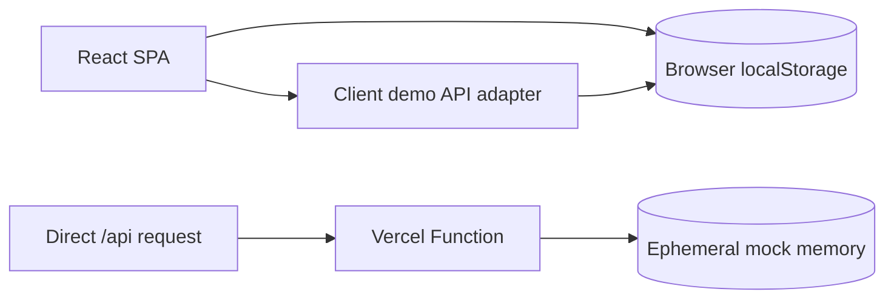

# Medical Device Lifecycle Manager

**Portfolio Demo - Fictional Data**

A self-contained React and TypeScript portfolio demonstration for managing the
inspection, preventive maintenance, repair, and reporting lifecycle of
fictional biomedical equipment.

This repository does not connect to a database, Supabase, Firebase, a
production system, or any private environment. All facilities, people,
devices, identifiers, and activity records are fictional.

## Project overview

The demo presents an end-to-end operational workflow:

1. Register or import a fictional medical device.
2. Perform preventive-maintenance and safety checks.
3. Route failed devices through a simulated repair workflow.
4. Review results and issue a sample certificate.
5. Search history and view dashboard metrics.

The interface is primarily Thai with supporting English terminology.

## Features

- Five demo roles with client-side role-aware navigation
- Fictional medical-device registry and workflow dataset
- Search, filtering, CSV/Excel/PDF import, and PDF export
- Qualitative and quantitative IPM checklists
- Simulated repair, approval, and certificate workflows
- Dashboard metrics and sample activity history
- Browser-local temporary changes using `localStorage`
- Downloadable demo JSON snapshots instead of external data writes
- Mock-only Express API responses for direct `/api` requests
- Responsive layouts, loading states, keyboard focus, and reduced motion

## Architecture



Normal application use is handled entirely in the browser. `apiFetch`
intercepts same-origin `/api/*` calls and maps them to a local demo adapter.
This makes refresh behavior predictable and prevents the UI from depending on
serverless instance memory.

The Vercel Function remains available for API demonstrations and returns only
mock data. Its writes are ephemeral and never leave the running function
instance.

## Tech stack

| Layer | Technologies |
| --- | --- |
| Frontend | React 19, TypeScript, Vite, Tailwind CSS 4, Motion, Lucide React |
| Demo state | Browser `localStorage` with bundled TypeScript mock data |
| Mock API | Express 4 on Vercel Functions |
| Documents | PDF.js, jsPDF, jsPDF AutoTable, SheetJS |
| Deployment | Vercel Functions and Vite static hosting |

## Installation

Prerequisites:

- Node.js 20 or newer
- npm 10 or newer

```bash
git clone https://github.com/Natchapoom2548/IPM-System-Portfolio.git
cd IPM-System-Portfolio
npm install
npm run dev
```

Open `http://localhost:3000`. No environment file or external runtime service
is needed.

## Environment variables

**None.**

`.env.example` intentionally contains documentation comments only. Do not add
database URLs, API keys, access tokens, or production credentials to this
portfolio demo.

## Demo

All accounts use the intentionally public password:

```text
Demo123!
```

| Username | Role |
| --- | --- |
| `demo_admin` | Administrator |
| `demo_registration` | Device registration |
| `demo_ipm` | Inspection and maintenance |
| `demo_repair` | Repair |
| `demo_reporting` | Reporting and certificates |

The login screen provides one-click account selection. These credentials work
only inside this fictional demo and are not accepted by any external service.

### Demo data behavior

- Initial data comes from `src/data/mockData.ts`.
- Changes are saved under versioned `portfolio_demo_*` browser keys.
- Refreshing restores temporary changes in the same browser.
- Choosing **Reset demo** on the login screen restores the bundled defaults.
- Clearing site storage also resets the demo.
- A storage-blocked browser falls back to in-memory data for the current tab.

## Running locally

```bash
npm run dev
```

Verification commands:

```bash
npm run lint
npm run build
npm run build:node
```

`npm run build` creates the Vite output used by Vercel.
`npm run build:node` additionally creates a private standalone Node bundle for
local production-style verification.

## Deploying to Vercel

1. Import this GitHub repository into Vercel.
2. Keep the framework preset as Vite.
3. Do not configure environment variables.
4. Deploy.

`vercel.json` builds the static application and routes `/api/*` to the
mock-only Express Function. No database setup, schema initialization, or
credential configuration is required.

## Screenshots

Recommended sanitized portfolio captures:

- Demo login and account selector
- Executive dashboard
- Device registry
- IPM checklist workflow
- Certificate and reporting view

## Folder structure

```text
.
├── api/                    # Vercel mock API adapter
├── src/
│   ├── assets/             # Generic portfolio images
│   ├── components/         # Screens and workflow UI
│   ├── data/               # Fictional devices and demo accounts
│   ├── utils/              # Local demo API and shared utilities
│   ├── App.tsx             # Application shell and workflow state
│   └── types.ts            # Domain types
├── server.ts               # Mock-only Express API
├── vercel.json             # Vercel build and routing
└── vite.config.ts          # Vite configuration
```

## Future improvements

- Add automated unit and browser tests
- Add GitHub Actions for type-checking, builds, and secret scanning
- Add sanitized screenshots and a public Vercel URL
- Split the largest workflow screens into focused feature modules
- Add an explicit in-app data export/import control for demo sessions

## License

Licensed under the [Apache License 2.0](./LICENSE), matching the SPDX headers
in the source files. The bundled Sarabun font is distributed under the
[SIL Open Font License](./src/assets/fonts/LICENSE.txt).
